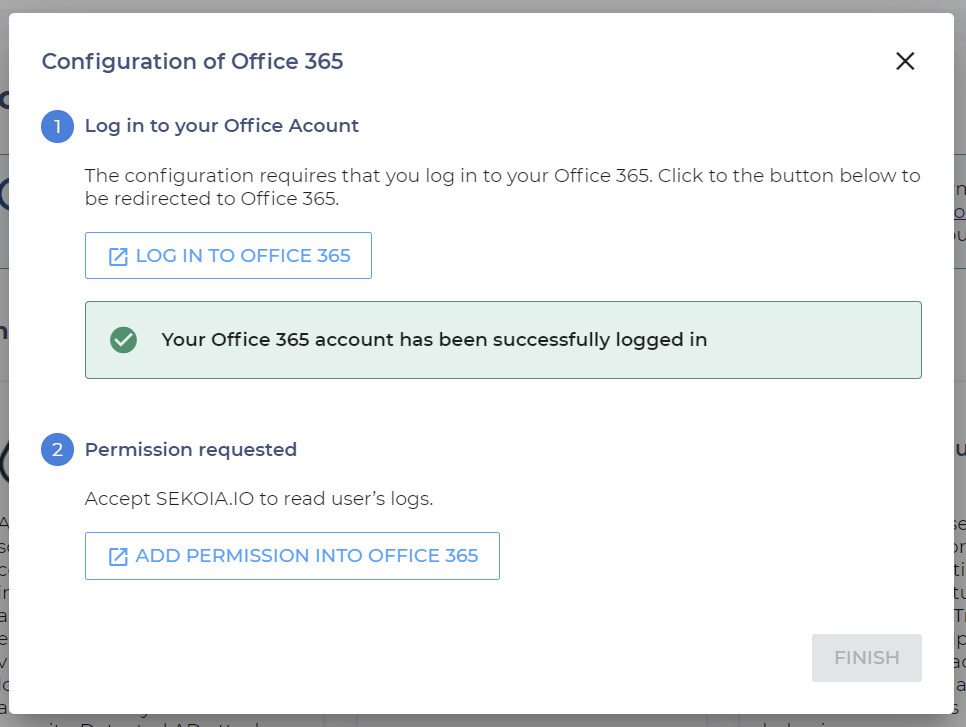

uuid: caa13404-9243-493b-943e-9848cadb1f99
name: Office 365

## Overview

Office 365 is a line of subscription services offered by Microsoft as part of the Microsoft Office product line.

## Office365 logs

Microsoft Office 365 API logs four categories of logs:

- Audit.AzureActiveDirectory
- Audit.Exchange
- Audit.SharePoint
- Audit.General


## Transport to SEKOIA.IO via API

Sekoia has developed an automatical setup for collecting Microsoft Office 365 logs from its dedicated API.

### Prerequisite

- Have access to the Operations Center in order to create an intake
- Be Administrator of the MS O365
- Configure the MS O365 logging in the GUI
{: style="max-width:60%"}

### Interconnexion set-up

In order to exploit the automatic interconnection method, please follow these steps:

- Log to the Operations Center
- Go to Configure > Intakes, and click on `+ INTAKE`
- Choose Office 365 intake by clicking on `CREATE`
- Enter the Intake name and the related Enity, then click on `Automatically`
{: style="max-width:60%"}
- Click on `LOG IN TO OFFICE 365`, then `ADD PERMISSION INTO OFFICE 365`
{: style="max-width:60%"}
- Choose your Office account

## Optionnal mode

### Manual mode

#### Prerequisites

This setup guide will show you how to generate, store and forward events produced by Office 365 service to SEKOIA.IO.
Theses changes have to be made from the Azure web portal ([https://portal.azure.com](https://portal.azure.com)).

#### A. Event Hubs

As a prerequisite you need an `Event Hub` (e.g. company-eventhub) and to choose an existing `resourceGroup` or create a new one (e.g. company-resource-group).
You also need your `Subscription ID` if you don't have a default one.

Navigate to: `Home > Cost Management + Billing > Subscriptions`. From there, copy the relevant `Subscription ID` that will be used in the command line (e.g. uuid)
Then you use Azure PowerShell (within Cloud Shell interface for example): you will create a global `Event Hubs`, then specific `Event Hub` (e.g. o365-event).
```powershell
PS Azure:\> az eventhubs namespace create --name company-eventhub --resource-group company-resource-group --enable-kafka true --subscription uuid

PS Azure:\> az eventhubs eventhub create --resource-group company-resource-group --namespace-name company-eventhub --name o365-event --message-retention 3 --partition-count 4 --subscription uuid
```

Navigate to: `Home > Event Hubs > company-eventhub - Shared access policies`. From there, you can create a policy (e.g. RootManageSharedAccessKey) with the claims `Manage`, `Send` and `Listen`, and note the `Primary Key` that will be used as the `SharedAccessKey`.
Navigate to: `Home > Event Hubs > company-eventhub > o365-event - Shared access policies`. From there, you can create a policy (e.g. sekoiaio-nifi) with the claims `Listen`.
> Once created, click on the policy and save the `Connection string-primary key`, to be sent to SEKOIA.IO.
Navigate to: `Home > Event Hubs > company-eventhub > o365-event - Consumer groups`. From there, you can create a consumer group (e.g. sekoiaio-nifi).

#### B. Office 365

Office 365 has to be added through Azure portal following the [Microsoft documentation](https://docs.microsoft.com/en-us/azure/azure-monitor/insights/solution-office-365)

Then you need to activate and configure the Office 365 diagnostic settings.
Navigate to: `Home > Office 365 > Monitoring > Diagnostic settings`:
- Add a new diagnostic setting, and select `Stream to an event hub`and click on configure.
- Select the previously created `Event hubs`, `Event Hub` and `SharedAccessKey`.
- Choose a name for this configuration and click on `Save`.


## Enjoy your events

You can send to Sekoia the `Connection string-primary key` previously mentioned.
Once the configuration has been done on Sekoia side, you can go to the [events page](https://app.sekoia.io/sic/events) to watch your incoming events.

## Further Readings
- [Microsoft Stream Azure monitoring data to an event hub](https://docs.microsoft.com/en-us/azure/azure-monitor/platform/stream-monitoring-data-event-hubs)
