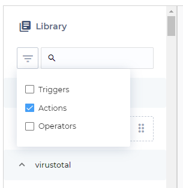
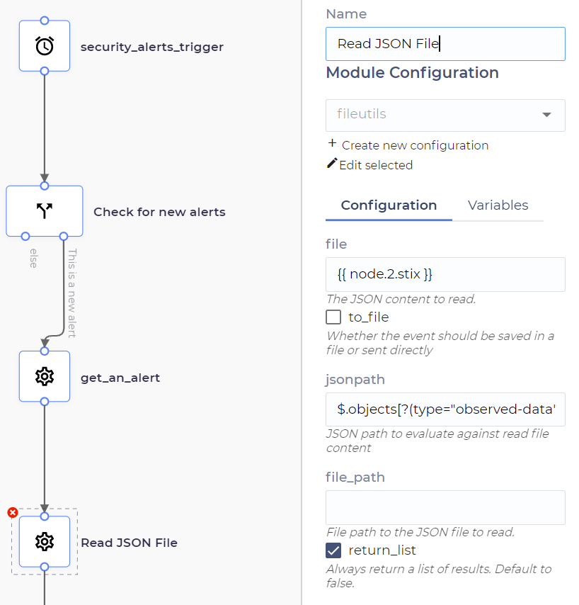
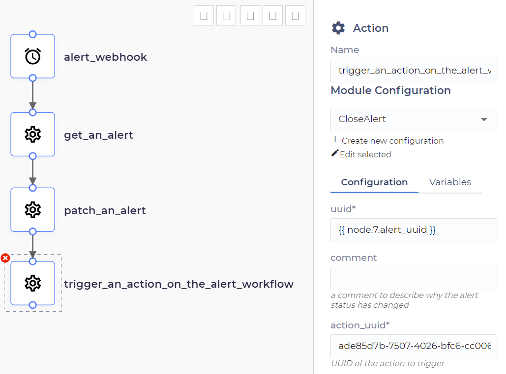
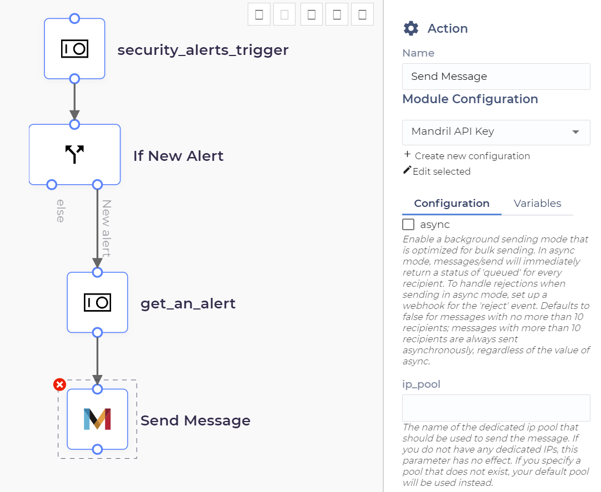

# Actions

## Types of Actions

Once the user has selected and configured a `Trigger`, most of the time an `Operator` will follow, then it is time to insert a first `Action`.

{: style="max-width:600px"}

The `Actions` execute specific activities depending on the needs. You will find hereafter the main `Actions` that a user will be able to use.

### Sekoia suggestions

#### Getters

##### Get an Alert or Get a Case

Allows a user to collect information on an Alert or a Case (incident) such as, but not limited to, the:

- Created (at, by) and update (at, by)
- Rule that raised the alert (uuid, name, type, pattern, severity, description)
- Related entity
- Source and Target
- Status (uuid, name, description)
- Urgency (value, severity, criticity, current_value)
- Comments (uuid, date, author, content)
- Countermeasures (comments, actions steps)
- Is_incident status

##### Get the list of comments of a case or the comment of a case
In order to exploit the comment posted on a case, it is first needed to collect all the meta information of the needed comment(s):
The only mandatory information needed is the `case_uuid` that you can collect by using the `Get a Case` module.

Then the user can exploit: the number of comments, uuid, created_at, created_by, created_by_type, content of the comment.

##### Read JSON File
With this module, a user can collect the output of the `Action > Get an alert` when the `parameter STIX` is activated. Here is an example of use:

{: style="max-width:600px"}

#### Setters 
On the playbook GUI, it is possible to set actionables such as Create, Update, Patch, Add, Post, Delete activities.

##### Create module 
With the Create module a user will be able to `Create`:

- A case
- An alert
- An asset

##### Update module 
With the Update module a user will be able to `Update`:

- A case

##### Patch module 
With the Patch module a user will be able to `Patch`:

- An alert

##### Add module 
With the Add module a user will be able to `Add`:

- Owners to an asset
- Key to the asset
- Attribute to the asset

##### Post module 
With the Post module a user will be able to `Post`:

- An asset
- An owner from an asset
- A key form an asset
- Attribute to the asset

##### Delete module 
With the Delete module a user will be able to `Delete`:

- A comment on an alert

##### Trigger an action on the event workflow
Is is possible to trigger an action on an alert as explained in the webhook section. For instance the following image shows how to properly close an alert afer analysing it.

{: style="max-width:600px"}

As of today, the available action_uuid are the following :
```r
Action:"Acknowledge", 	Description: "Acknowledge the alert", 	action_uuid:"937bdabf-6a08-434b-b6d3-d7447e4e452a"
Action:"Validate", 		Description: "Validate the alert", 		action_uuid:"c39a0a95-aa2c-4d0d-8d2e-d3decf426eea"
Action:"Reject", 		Description: "Reject the alert", 		action_uuid:"ade85d7b-7507-4026-bfc6-cc006d10ddac"
Action:"Close", 		Description: "Close the alert", 		action_uuid:"1390be4e-ced8-4dd6-9bed-573471b235ab"
```

Other Sekoia modules are available, such as:

- Associate new rule on a case
- Associate new alert on a case
- Activate or deny a countermeasure

### External Data Enrichers

Most of the time an analyst uses external tools in order to better understand the severity of the alert.
> If you have subscribed to one or more of the following online tools, you should be able to get an API key, and simply use it on your playbooks.

##### IKnowWhatYouDownload
The module allows to request information such as: 

- IP history
- IP Check
- IP List

##### Onyphe
The module allows to request information such as: 

- Scan (SYN, Onion...)
- Lookups (Md5, reverse DNS)
- Get IP additional information (Threat list, geolocalisation...)
- Scan Domain Name CTLs

##### RiskIQ
The module allows to request information such as: 
 
- Whois
- Reverse Whois (organisation, nameserver, name, email, address)
- Passive DNS (Name, IP, Hex)
- SSL host, certificate (SHA-1, Serial Number) / DNS

##### Showdan
The module allows to request information such as: 

- Search for Host information
- Get DNS reverse, resolve, domain

##### Virustotal
The module allows to request information such as: 

- Scan (URL, IP, Hash, File, Domain)

### Notifications

##### PagerDuty
This module allows the analysts to receive notification in PagerDuty when a new alert is raised.

##### MatterMost

- Sekoia alert: this module allows the analysts to receive notification in MatterMost when a new alert is raised.
- Post a message: additional information can be rooted on a specific channel with detailed context

##### Mandrill
Email notification is available, the following example shows an automatic email sent when a new alert is raised.

{: style="max-width:600px"}

The mandatory fields are:

- The recipient email address, name
- The sender email address, name
- The subject
- The HTML mail content, here is a simple example:
```HTML
<h1>A new alert is declared: {{ node.2.rule.name }}.</h1> 
<h2>Description: {{ node.2.rule.description }}.</h2>
<p>More details:</p> 
	<ul><li>Urgency: {{ node.2.urgency.value }}</li>
		<li>Entity: {{ node.2.entity.name }}</li>
	 	<li>Kill chain: {{ node.2.kill_chain_short_id }}</li>
	 	<li>Source: {{ node.2.source }}</li>
	 	<li>Target: {{ node.2.target }}</li>
 	</ul>
```

> The dynamic content is written in JINJA. For more information on this language, please follow this [documentation](https://jinja.palletsprojects.com/en/2.10.x/templates/).
