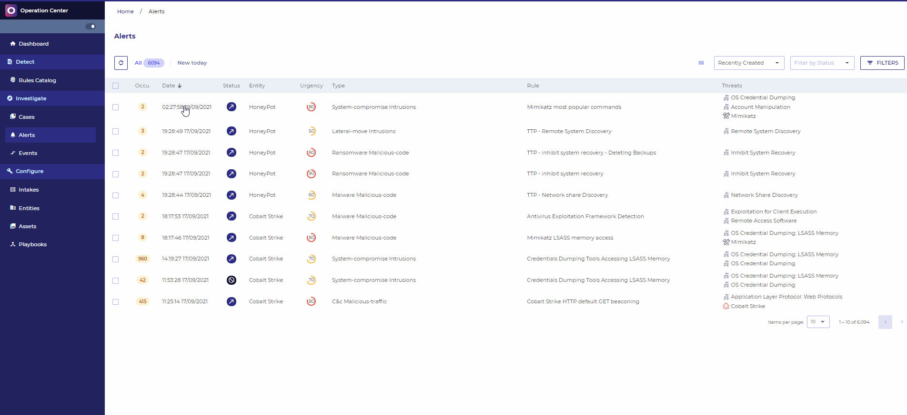

# Alerts Management

## Alerts List

When you first connect to SEKOIA.IO, alerts list is filtered and will diplay 'New today' alerts and sorted in descending order of urgency. The sort and filter choices you make from this list will be kept thereafter.

On this screen, you can view the following information:

- Alert Id, begin with AL followed by 10 alphanumeric characters. On the top right of the ID box, there may be an yellow round with a number, it's the similarity counter.
- Alert creation date
- Alert status. When hovering over the icon, a frame indicates the status modification date and who modified it.
- The entity to which the alert corresponds
- Urgency of the alert, between 0 and 100, 100 being the highest.
- The category and sub-category of alerts
- The name of the rule which triggered the alert
- The source and destination IP when event is a network event.

Alerts can be filtered by two ways: a rapid filter on the top left of the list and a list of cumulative filtering criteria on the top right of the screen.

## Alert Details

The access to the detail of an alert is done by clicking on the Alert ID in the Alert list.
The alert detail screen contains several blocks of information.
On the largest area of the screen is a graphic representation of the alert. It represents the different objects composing the alert, each type having its self icon. The yellow magnifying glasses represent the observed data, eg the events associated with the alert. Medical suitcase corresponds to proposed countermeasures, bug on red bubble to malware, and so on. When you click on these icons, the left part of the screen will display details of the selected element.
Alert type, description, kill chain phase and urgency can be modified, by clicking on the 'pencil' button on the top right of the frame.

Tab with a sticking plaster icon will display proposed countermeasures linked to the alert. You can act on countermeasures, confirming or rejecting them by clicking on the corresponding icons. A countermeasure can be constituted of several action steps, which can be confirmed or rejected independently if needed.
By confirming a countermeasures, you indicate to the platform that you have undertaken the corresponding action on your system. The urgency of the alert will thereby decrease, as well as the risk indicator.
Countermeasures are in OpenC2 format, which you can visualize by clicking on the '<>' icon.

### Alert statuses and lifecycle

There is five possible statuses for an alert:

- **Pending**: As soon as an alert is triggered, it is placed in 'Pending' status. If the generation mode for this alert is 'Automatic', this status changes automatically to 'Ongoing'. In other cases, the following actions are accepted: Acknowledge, Reject, Validate.
- **Acknowledged**: This status is used when an analysis is ongoing. If the analyst can decide if an alert is a true or a false positive quickly, this status can be optional, time to acknowledge used in statistics will be set to time to change to Ongoing or Rejected status.The following actions are accepted: Validate, Reject.
- **Ongoing**: Alert is considered as true positive and countermeasures are not yet been applied. This status is the first one seen in case of automatic mode. The following actions are accepted: Close (countermeasures have been applied, no more alert), Reject (after more analysis, this alert was a false positive).
- **Closed**: Every necessary actions have been applied for the alert. This status is a final status, no action accepted.
- **Rejected**: The alert was a false positive. This status is a final status, no action accepted.

### Alert Urgency

The Urgency is a number used to give a score to the risk associated with a specific alert. It is calculated from the severity of a rule and the criticality of assets related to the alert.
This gives a value between 1 (very low risk) and 100 (very high risk).
The urgency is provided under two different representations on alert detail: a numerical and a textual representation.

|Display     |Value       |
|:----------:|:----------:|
|Low         |[0-20[      |
|Moderate    |[20-40[     |
|High        |[40-60[     |
|Major       |[60-80[     |
|Urgent      |[80-100]    |

### Similarity

Alert similarity aims to regroup similar events in existing alerts. When an event matches with a rule, an alert is raised. If there is already an alert with similar information (rule, entity, source and destination), the event is associated with this existing alert rather than used to create a new one. This association is done only for Pending, Acknowledged and Ongoing alerts. If there's a matching alert on status Closed or Rejected, a new alert will be triggered by the event.

Similarity counter is shown on a yellow circle on the top right of the alert id on the list. The number corresponds to the added events to an existing alert.

### Alert type and category

The Alert Type is associated with the rule template, but can be changed with the value associated to specific indicators in case of cti rules.

The Alert Type is defined according to a custom set of values derived from theReference Incident Classification Taxonomy of ENISA:

- abusive-usage
	- bandwidth-download
	- bandwidth-upload
	- p2p
	- high-drop
- abusive-content
	- spam
	- harmfull-speech
	- violence
- malicious-code
	- virus
	- worm
	- trojan
	- spyware
	- dialer
	- rootkit
	- malware
	- botnet-drone
	- ransomware
	- malware-configuration
	- c&c
- information-gathering
	- scanner
	- sniffing
	- social-engineering
	- portscan
	- sweepscan
	- appscan
- intrusion-attempts
	- ids-alert
	- brute-force
	- exploit
- intrusions
	- privileged-account-compromise
	- unprivileged-account-compromise
	- application-compromise
	- bot
	- defacement
	- compromised
	- backdoor
- availability
	- dos
	- ddos
	- sabotage
	- outage
- information-content-security
	- Unauthorised-information-access
	- Unauthorised-information-modification
- fraud
	- unauthorized-use-of-resources
	- copyright
	- masquerade
	- phishing
- vulnerable
	- vulnerable-service
- other
	- blacklist
	- unknown
	- other
- test
	- test
