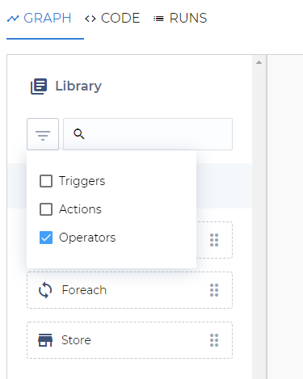
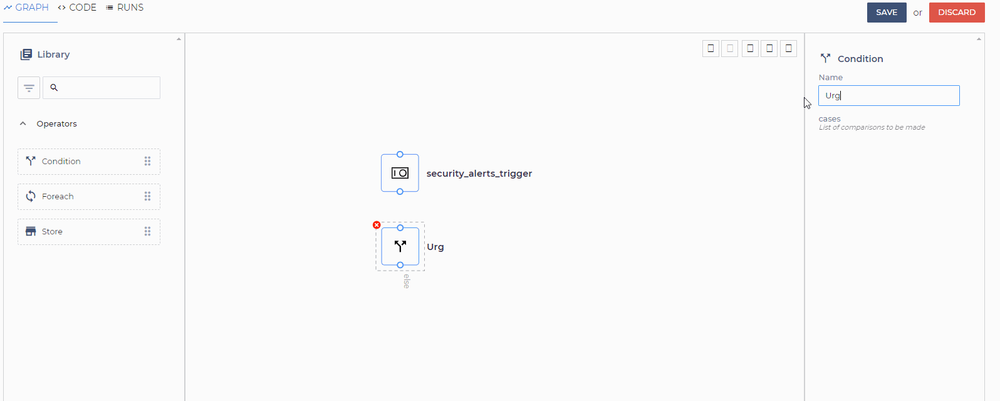

# Operators

## Types of Operators

Once the user has selected and configured a `Trigger`, it is time to choose from tree different `Operators` that can be retrieved by filtering the library on the top left.

{: style="max-width:60%"}

The `Operators` are used to filter, loop or store the data generated by a `Trigger` or an `Action`.

### Condition

The `Operator` "Condition" is similar to the If...Else condition. It allows a user to test a variable. It can be followed by an `Action` or an `Operator`, even a "Condition".

To edit a condition, it is needed to add a case, by clicking on the "+". For instance:

{: style="max-width:60%"}

### Foreach

The `Operator` "Foreach" is specialised in the browsing of a list of data, such as a JSON or STIX output.
It can be followed by multiple `Blocks` such as the `Action` ones or the `Operator` ones, even a "Foreach" loop.

### Store

The `Operator` "Store" allows a user to store data before using it in the same playbook. For instance the following video shows how to store a port number after a loop over a JSON formatted input, and use it to alter the status of an alert.

{: style="max-width:60%"}
