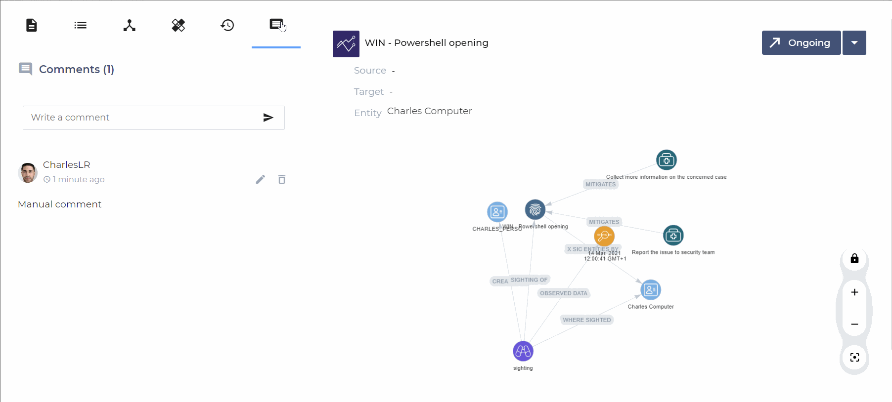

# Triggers

To start creating a playbook, a `Trigger` is needed in order to launch the start of the playbook execution.

## Types of Triggers

In the Operation Center, section Playbooks, once you have selected a created playbook, you will be able to filter the `Blocks` into one of the three categories: `Triggers, Operators and Actions`. Here we want to filter on `Triggers` only.

{: style="max-width:600px"}

The `Triggers` collects data that will be used by the Operators and Actions to answer a specific need.

### Alerts

The `Security alerts` trigger allows a user to collect information of an alert, such as the `alert_uuid`, its date of creation (`created_at`), its category (`alert_type`), its `urgency` or the action that triggered THIS alert notification (`event_type`) for example "alert-created", "alert-status-changed", "alert-comment-created" etc.

### Webhook

The `Alert webhook` trigger allows a user to automatically trigger actions once a human has raised and removed a doubt on an alert.
This is a `Block` button, such as the one you will find hereunder, for the example of adding an standardised commentary on the alert commentary section. 

{: style="max-width:600px"}

### Cron

The `Cron` trigger allows a user to periodically launch an automatic action, that should be defined and created by a user.
