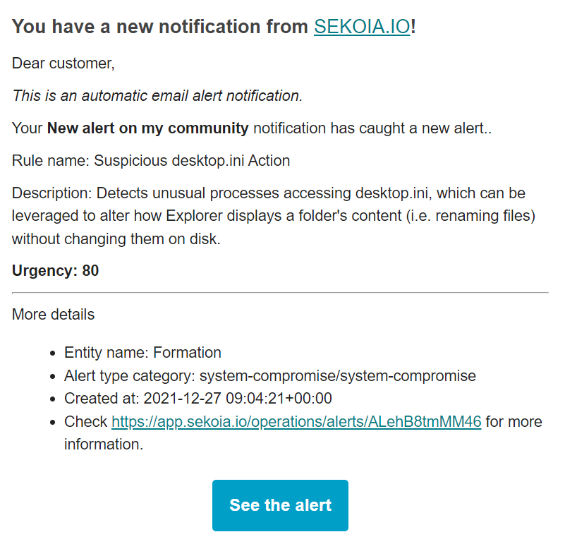
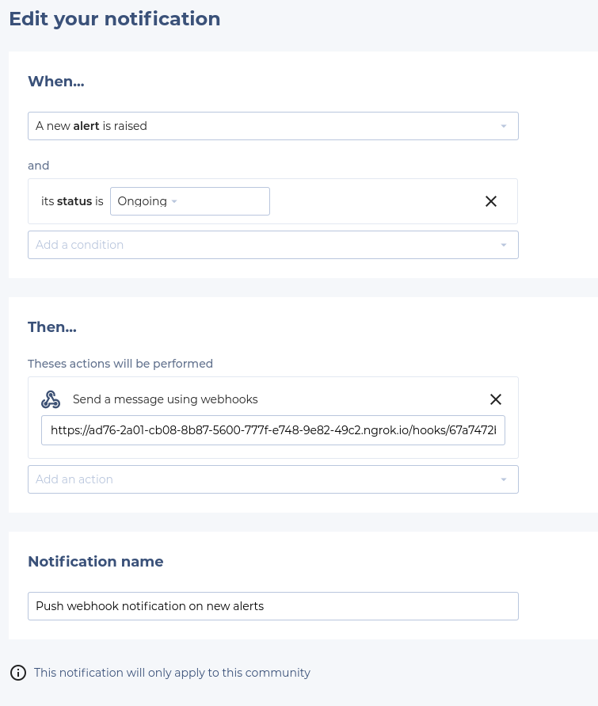

# User Center: Notification Rules

SEKOIA.IO’s User Center let you configure “Notification Rules” so you can be kept informed of new activities that happens on SEKOIA.IO.

Notifications Rules will let you:

- Focus on specific SEKOIA.IO events (Operations Center alerts and Intelligence Center reports).
- Add precise conditions.
- Configure actions to be triggered (send an e-mail, display a notification in SEKOIA.IO, …).


This documentation will let you go deeper into SEKOIA.IO’s notification mechanism.

Each notification mechanism, once created, can be modified, duplicated, deleted and (de)activated from the main Notification page of the User Center.

A search bar and filters are available on this same page.


## Available Conditions

To write a new notification rule, the first step consists in selecting an “event” and conditions that will trigger your notification rule.

### Operations Center Alerts

You can configure your notification rule to be triggered on “**alerts**” (that can be either new or already existing). Then, you’ll have to choose one or multiple conditions amongst multiple options (alert status, its urgency, asset concerned by the alert, etc.).

For example, you can decide to trigger a notification when the following criteria are met:

- Status of the new alert is “Ongoing”.
- Urgency of the new alert is higher than 80.
- Involved asset is “My Critical Asset”.


### Intelligence Center Reports

You can configure your notification rule to be triggered when a new “report” is merged in SEKOIA.IO’s Intelligence Center. Then, you’ll have to choose one or multiple conditions amongst multiple options (its name contains or description some text, it concerns some country, etc.).


If you want to only trigger a notification when a report that concerns a specific CTI object is added to the Intelligence Center, you can choose the “it refers to” option. Then you’ll be able to select a CTI object from the available list:


## Triggered Actions

When your conditions are configured, you want to decide which action should be triggered by the notification mechanism. You can enable one or more action for each notification rule.

For example you can decide to send an e-mail and to send a message on a Mattermost channel.

### SEKOIA.IO Notification

The “Notification” action allows you to send an “in-app” notification that will be made available across SEKOIA.IO. All notifications can be accessed from the “bell” icon on the top right. By clicking there, the notification panel with all notifications will be displayed.

### E-Mail Notification

The “E-mail notification” will let you send an e-mail to an arbitrary address with the two differents options:

- By default, simple notification content will be sent with a link to SEKOIA.IO page corresponding of the Condition(s) set-up.
- If you toggle the ”Enrich email with contextual infos” button, more contextual information related to your alert will be communicated, such as displayed hereafter.



### Mattermost Notification

The “Mattermost notification” will let you send messages to any Mattermost instance (Mattermost is a popular chat service). To do so, you’ll have to configure a new “Incoming Webhook” on your Mattermost instance and choose to which Mattermost channel the message should be sent to.

You can refer to the Mattermost documentation on how to [create a new Mattermost “incoming webhook”](https://docs.mattermost.com/developer/webhooks-incoming.html).

### WebHook Notification

The “WebHook notification” will let you send message to interact with third party softwares. Technical informations related to the event will be pushed to an HTTP server. That latter will be able to understand the received payload and act (for example, retrieve more information about the event itself via SEKOIA.IO APIs and then push notification to an internal messaging service).

!!! info
    You can’t use the WebHook notification mechanism to push informations directly to third parties (such as Slack or Telegram), you have to use an intermediate server. To do so, you can use solutions like IFTTT or a simple HTTP server (see below).



Here’s an example of a posted content to a configured destination via the WebHook mechanism:

```json
{
  "type": "alert",
  "action": "created",
  "attributes": {
    "uuid": "5696845f-9ecf-4431-9f0f-48ee0ee2eff1",
    "short_id": "ALEY4fqz8moo"
  },
  "metadata": {
    "version": 2,
    "created_at": "2022-01-14T15:06:57.398005+00:00",
    "community_uuid": "d6cea089-0f36-46c4-a10a-0e4c2e20fb10",
    "avatar_uuid": null,
    "user_uuid": null,
    "permissions": []
  }
}
```

This payload is about a newly _created_ _alert_ which concerns the `d6cea089-0f36-46c4-a10a-0e4c2e20fb10` community and which identifier is `ALEY4fqz8moo` (or `5696845f-9ecf-4431-9f0f-48ee0ee2eff1` if you prefer the UUID form).

Payload fields description:

| Payload title             | Availability   | Description                                                                                            |
|---------------------------|----------------|--------------------------------------------------------------------------------------------------------|
| `type`                    | Always         | Event type, can be `alert` or `content-proposal` (for reports). More types will be added in the future |
| `action`                  | Always         | Action that took place, can be `created`, `updated`, `deleted`.                                        |
| `metadata`                | Always         | This object contains information around the event itself                                               |
| `metadata.version`        | Always         | Version of the event, WebHook events are currently at version 2.                                       |
| `metadata.created`        | Always         | Date of creation of the _event_.                                                                       |
| `metadata.community_uuid` | Always         | Community concerned by the event.                                                                      |
| `metadata.avatar_uuid`    | Always         | Event that concerns only a single member of a community (not used for alerts or reports).              |
| `metadata.user_uuid`      | Always         | Event that concerns only a single user of SEKOIA.IO.                                                   |
| `metadata.permissions`    | Always         | Unused.                                                                                                |
| `attributes.uuid`         | Alert specific | Unique identifier of the alert (UUID). Can be used to talk to the Alert API.                           |
| `attributes.short_id`     | Alert specific | Human readable alert unique identifer.                                                                 |


Now, let’s say that you want to post a notification to your internal Microsoft Teams messaging system when a new alert is raised. To do so, you have to write a small HTTP server that will receive the payload, and will then talk to SEKOIA.IO’s Alert API to retrieve more information about the alert itself (its title, its urgency, etc.). Then, the final message is computed and pushed to Microsoft Teams via their incoming WebHook system.

Here’s an example of an HTTP server written in Python and FastAPI:

```python title="main.py"
"""Sample notification handler for SEKOIA.IO WebHook Notifications.

Sample FastAPI application that is in charge of receiving WebHook
events from SEKOIA.IO’s Notification mechanism, enrich event by
talking to SEKOIA.IO’s Alert API and then to push a notification to
Microsoft Teams, via an incoming WebHook.

"""

from datetime import datetime
from typing import Literal, Optional

import httpx
from fastapi import BackgroundTasks, FastAPI
from pydantic import BaseModel, BaseSettings


class WebHookSettings(BaseSettings): # (4)
    apikey: str
    teams_webhook_url: Optional[str] = None


class SEKOIAIOWebHookAlertAttributes(BaseModel):
    uuid: str
    short_id: str


class SEKOIAIOWebHookMetadata(BaseModel):
    version: int = 2
    created_at: datetime
    community_uuid: str
    avatar_uuid: Optional[str] = None
    user_uuid: Optional[str] = None
    permissions: Optional[list[str]] = None


class SEKOIAIOWebHookEvent(BaseModel): # (5)
    type: Literal["alert"]
    action: str
    attributes: SEKOIAIOWebHookAlertAttributes
    metadata: SEKOIAIOWebHookMetadata


app = FastAPI()
settings = WebHookSettings()


async def push_notification_to_teams(event: SEKOIAIOWebHookEvent):
    """Simple task that will extract the retrieve the full alert via
    SEKOIA.IO API and then creates a message that will be posted on
    Microsoft Teams via a predefined incoming WebHook.

    """
    async with httpx.AsyncClient() as client:
        response = await client.get( # (2)
            f"https://api.sekoia.io/v1/sic/alerts/{event.attributes.uuid}",
            params={"stix": False},
            headers={"Authorization": f"Bearer {settings.apikey}"},
        )
        if response.status_code == 200:
            alert = response.json()
            message = (
                f"A new alert “{alert['title']}” was created on SEKOIA.IO with "
                "status “{alert['status']['name']}” and “{alert['urgency']['display']}” severity."
            )
            if settings.teams_webhook_url:
                client.post(settings.teams_webhook_url, json={"text": message}) # (3)


@app.post("/hooks/67a7472b-b43c-415d-b1ce-c135fb1dfb0e") # (1)
async def handle_new_alert(
    event: SEKOIAIOWebHookEvent, background_tasks: BackgroundTasks
):
    background_tasks.add_task(push_notification_to_teams, event)
```

1. :man_raising_hand: Entrypoint of our HTTP server that receives SEKOIA.IO WebHook notifications. Please define a unique URL, using and UUID for example.
2. :man_raising_hand: Code in charge of collecting more information on the alert itself by talking to SEKOIA.IO APIs.
3. :man_raising_hand: Send the final text message to Microsoft Teams.
4. :man_raising_hand: Environment variables that needs to be defined to let the server work.
5. :man_raising_hand: Base model that will be used to parse incoming events (this version only handles alerts).

Now, you have to create a new API Key in SEKOIA.IO’s User Center. That one should have at least the right to read alerts (`SIC_READ_ALERT` permissions).

Then you have to install requirements and start the HTTP server with the appropriate environment variables:

```bash
python -m venv venv
source venv/bin/activate # (1)

pip install "fastapi[uvicorn]" "uvicorn[classic]" "httpx" # (2)

export APIKEY="eyJ0eXAiOiJ…" # (3)
export TEAMS_WEBHOOK_URL="https://…"

poetry run uvicorn main:app # (4)

ngrok http 8000 # (5)
```

1. Create a Python virtual environment to install our code
2. Install requirements
3. Export environment variables
4. Start the server
5. Then, you can use ngrok to provide access to your local code (development only)

Finally, you to configure SEKOIA.IO’s WebHook notification to push events to your HTTP server on the following URL: `https://ad76-2a01-cb08-8b87-5600-777f-e748-9e82-49c2.ngrok.io/hooks/67a7472b-b43c-415d-b1ce-c135fb1dfb0e`.
